#cocos2d-x iOS集成push

###前言

使用推送消息可提高玩家的粘性。提醒用户，召回玩家。

本文主要内容：

* iOS Push基本理念
* 创建工程
* ios push相关配置
* push集成
* push 测试和使用
* 总结
* 相关资料

### iOS Push基本理念
我们先来了解，iOS push实现的大概原理

  
 从上图我们可以看到。  
   1. 首先是应用程序注册消息推送。  
   2. IOS跟APNS Server要deviceToken。应用程序接受deviceToken。  
   3. 应用程序将deviceToken发送给PUSH服务端程序。  
   4. 服务端程序向APNS服务发送消息。  
   5. APNS服务将消息发送给iPhone应用程序。  
    无论是iPhone客户端跟APNS,还是Provider和APNS都需要通过证书进行连接的
### 创建工程

工程基于 cocos2d-x 2.2 引擎, 针对ios.

[cocos2d-x 2.2 下载地址](http://cdn.cocos2d-x.org/cocos2d-x-2.2.2.zip)
如果已经有cocos2d-x 引擎可以跳过，直接进入cocos2d-x-2.2/tools/project-creator目录,运行脚本
./create_project.py -project paoku -package com.polyvi.pushDemo -language cpp 创建工程。

### push相关配置

* 登陆 [iOS Dev Center](https://developer.apple.com/devcenter/ios/index.action) 选择进入iOS Provisioning Portal。创建应用程序ID
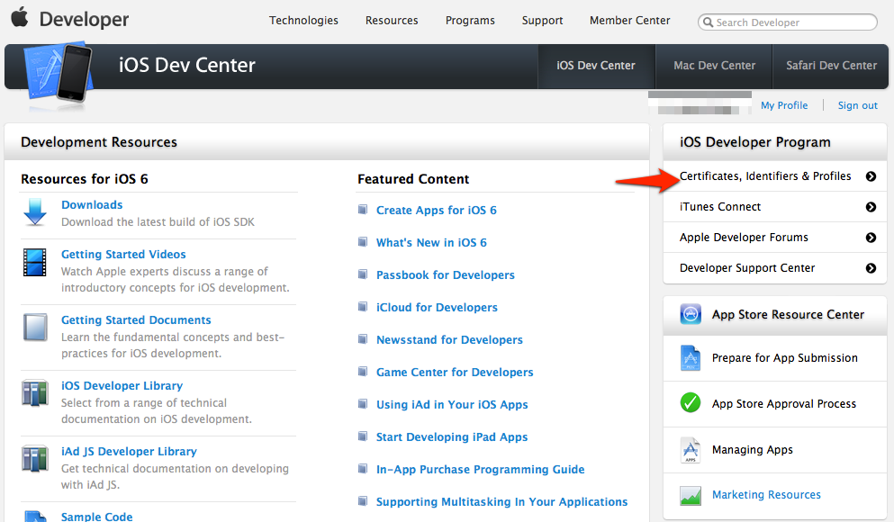  

* 在 iOS Provisioning Portal中，点击App IDs进入App ID列表。
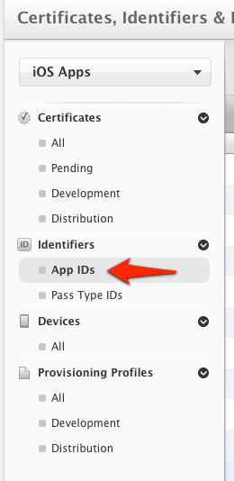  


* 创建 App ID，如果 ID 已经存在可以直接跳过此步骤
  


* 为 App 开启 Push Notification 功能。如果是已经创建的 App ID 也可以通过设置开启 Push Notification 功能。
  


* 根据实际情况完善 App ID 信息并提交,注意此处需要指定具体的 Bundle ID 不要使用通配符。
  

* push cer创建 develop 和 production
如果你之前没有创建过 Push 证书或者是要重新创建一个新的，请在证书列表下面新建。
   
新建证书需要注意选择证书种类（开发证书用于开发和调试使用，生产证书用于 App Store 发布）
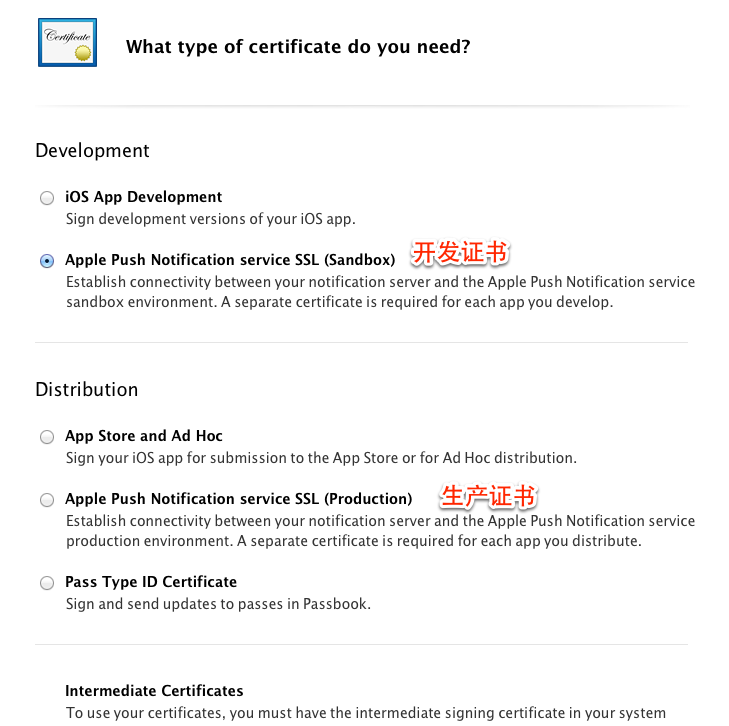  


* 点击 Continue 后选择证书对应的应用ID，然后继续会出现“About Creating a Certificate Signing Request (CSR)”。
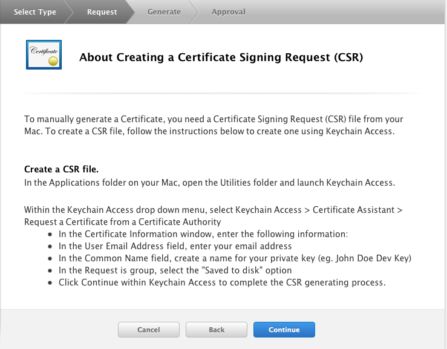  

* 根据它的说明创建打开KeychainAccess 创建 Certificate Signing Request。
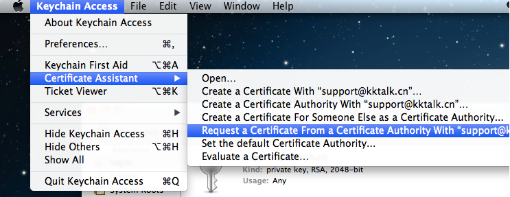  


* 填写“User Email Address”和“Common Name” 后选择 Saved to disk 进行保存 。
   
继续返回Apple developer 网站点击 Continue ，上传刚刚生成的 .certSigningRequest 文件生成 APNs Push  Certificate。
下载并双击打开证书，证书打开时会启动“钥匙串访问”工具。
在“钥匙串访问”中你的证书会显示在“我的证书”中，注意选择“My Certificates” 和"login"
  

* 导出 .p12 证书文件
在“钥匙串访问”中，选择刚刚加进来的证书，选择右键菜单中的“导出“...””。
注意要选“login”和“My Certificates” 导出证书时要选中证书文件，不要展开private key。
  
将文件保存为Personal Information Exchange (.p12)格式。
保存p12文件时，可以为其设置密码，也可以让密码为空。

* app Provisioning Profile 创建,选取app Id, Certificates,Devices. 分develop 和 production
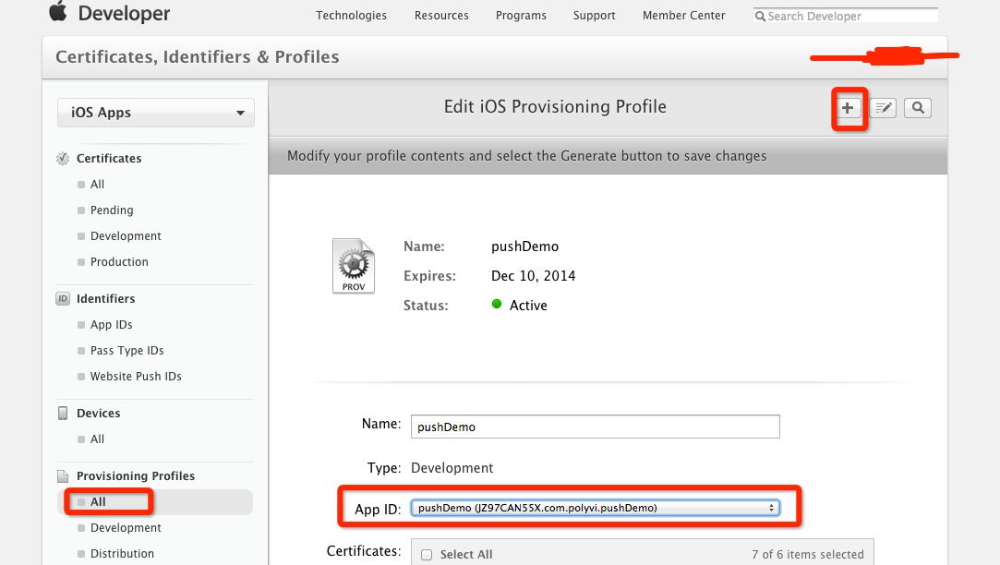   

详见：
[iOS 证书 设置指南](http://docs.jpush.cn/pages/viewpage.action?pageId=1343727)


### push集成
* 新建pushHelper C++类,定义监听push回调相关的接口。

```
class  pushHelper
{    
public:
    /** returns a shared instance of the pushHelper
     *  @js getInstance
     */
    static pushHelper* sharedPushHelper(void);

    /**
     @brief  The function be called when the application launching receive remote notification
     @param  notificationJson the pointer of the notification json string
     */
    bool applicationDidFinishLaunchingWithNotification(const char* notificationJson);
    
    /**
     @brief  The function be called when the application register remote notification success
     @param  deviceToken the pointer of the notification token string
     */
    void applicationDidRegisterForRemoteNotificationsWithDeviceToken(const char *deviceToken);

    /**
     @brief  The function be called when the application register remote notification failed
     @param  error the pointer of the register remote notification failed string
     */
    void applicationdidFailToRegisterForRemoteNotificationsWithError(const char *error);
    
    /**
     @brief  The function be called when the application running receive remote notification
     @param  notificationJson the pointer of the notification json string
     */
    void applicationDidReceiveRemoteNotification(const char* notificationJson);
    
};
```

* 在AppController.mm加入 ios remoteNotification 相关实现

1. 在application: didFinishLaunchingWithOptions:注册push的种类，并处理启动时收到push

```
    //======================push========================
    
    [application registerForRemoteNotificationTypes:
     UIRemoteNotificationTypeAlert
     | UIRemoteNotificationTypeBadge
     | UIRemoteNotificationTypeSound];
    
    [application setApplicationIconBadgeNumber:0];
    
    //启动时收到push delay 5s派发
    NSDictionary * userInfo = [launchOptions objectForKey:UIApplicationLaunchOptionsRemoteNotificationKey];
    if(userInfo) {
        [application setApplicationIconBadgeNumber:0];
        NSLog(@"LaunchOptionsRemoteNotification:%@",[userInfo description]);
        
        dispatch_after(dispatch_time(DISPATCH_TIME_NOW, (int64_t)(5 * NSEC_PER_SEC)), dispatch_get_main_queue(), ^{
            pushHelper::sharedPushHelper()->applicationDidFinishLaunchingWithNotification([[userInfo description] cStringUsingEncoding:NSUTF8StringEncoding]);
        });
    }
    
    //======================push========================
```
2. 在application: didRegisterForRemoteNotificationsWithDeviceToken:处理收到注册push成功返回的device token：

```
    NSLog(@"push deviceToken:%@",deviceToken);
    
    pushHelper::sharedPushHelper()->applicationDidRegisterForRemoteNotificationsWithDeviceToken([[deviceToken description] cStringUsingEncoding:NSUTF8StringEncoding]);
```
3. 在application: didReceiveRemoteNotification: 处理app运行状态下接收到的Push消息：

```
    NSLog(@"Receive Notify: %@", [userInfo description]);
    [application setApplicationIconBadgeNumber:0];

    pushHelper::sharedPushHelper()->applicationDidReceiveRemoteNotification([[userInfo description] cStringUsingEncoding:NSUTF8StringEncoding]);
```
4. 在application: didFailToRegisterForRemoteNotificationsWithError:处理注册push失败

```
    pushHelper::sharedPushHelper()->applicationdidFailToRegisterForRemoteNotificationsWithError([[error description] cStringUsingEncoding:NSUTF8StringEncoding]);
```

* 实现pushHelper.cpp

使用CCNotificationCenter 将通知派发，更灵活！降低耦合度！

```
bool pushHelper::applicationDidFinishLaunchingWithNotification(const char* notificationJson)
{
    CCLOG("applicationDidFinishLaunchingWithNotification=%s",notificationJson);
    CCNotificationCenter::sharedNotificationCenter()->postNotification(REMOTE_NOTIFICATION, new CCString(notificationJson));
    return true;
}

void pushHelper::applicationDidRegisterForRemoteNotificationsWithDeviceToken(const char *deviceToken)
{
    CCLOG("applicationDidRegisterForRemoteNotificationsWithDeviceToken=%s",deviceToken);
    CCNotificationCenter::sharedNotificationCenter()->postNotification(REGISTER_REMOTE_NOTIFICATION_DEVICE_TOKEN, new CCString(deviceToken));
}

void pushHelper::applicationdidFailToRegisterForRemoteNotificationsWithError(const char *error)
{
    CCLOG("FailToRegisterForRemoteNotificationsWithError=%s",error);
    CCNotificationCenter::sharedNotificationCenter()->postNotification(REGISTER_REMOTE_NOTIFICATION_ERROR, new CCString(error));
}

void pushHelper::applicationDidReceiveRemoteNotification(const char* notificationJson)
{
    CCLOG("applicationDidReceiveRemoteNotification=%s",notificationJson);
    CCNotificationCenter::sharedNotificationCenter()->postNotification(REMOTE_NOTIFICATION, new CCString(notificationJson));
}
```


### push测试

push 消息的推送 需要客户端和服务器的支持。  
自己搭建以推送服务器还是比较麻烦的。
现在国内主流的第三方push方案（百度云推送、极光推送、个推）,大致都提供push集成客户端SDK 和 push消息推送控制台 或 消息推送SDK，推送结果统计。根据应用ID注册，消息推送条数 决定收费。

在此，本demo使用免费百度云推送方案。

* 集成百度云推送
[参考文档](http://developer.baidu.com/wiki/index.php?title=docs/cplat/push/guideios#SDK.E9.9B.86.E6.88.90)

1. 上[百度开发者](http://developer.baidu.com/console#app/project)注册工程
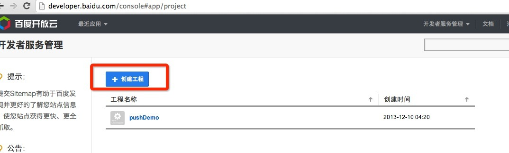 
2. 参照文档完成客户端SDK的集成,加入baidu 云推送 依赖的framework
3. 完善工程配置,develop / production选择，上传APNS证书
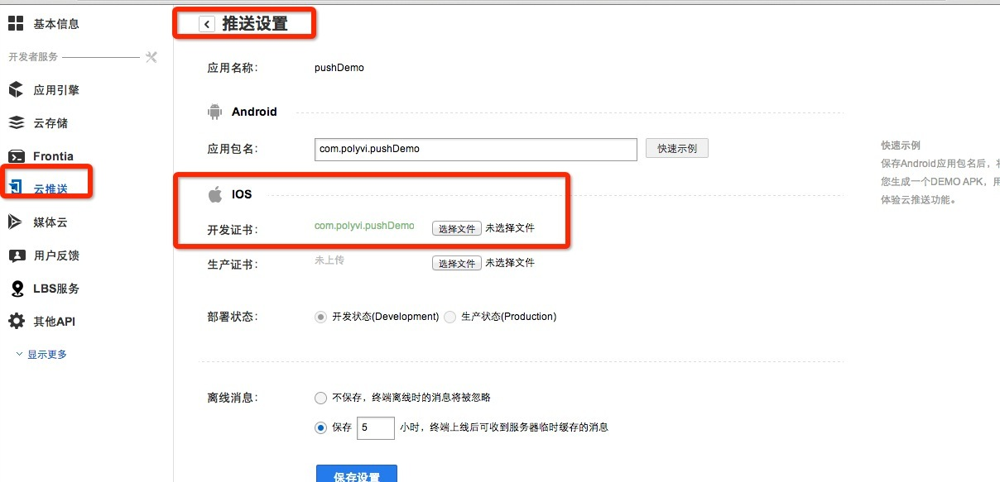 

4. 使用百度云推送控制台推送push
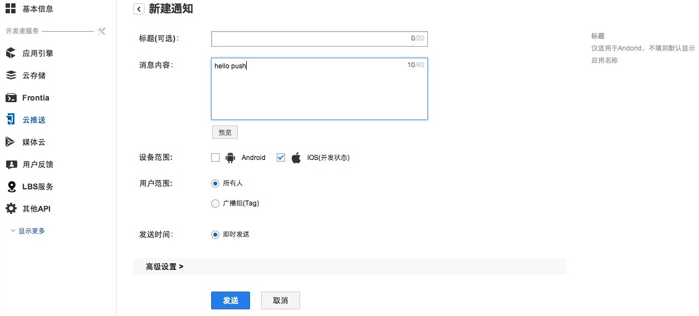 

### push使用

在想使用remoteNotification 消息的scene加入如下代码：

* 监听remoteNotification

```
    //listen push
    CCNotificationCenter::sharedNotificationCenter()->addObserver(this, callfuncO_selector(HelloWorld::applicationDidReceiveRemoteNotification),
                                                                  REMOTE_NOTIFICATION, NULL);
    
    CCNotificationCenter::sharedNotificationCenter()->addObserver(this, callfuncO_selector(HelloWorld::applicationDidRegisterForRemoteNotificationsWithDeviceToken),
                                                                  REGISTER_REMOTE_NOTIFICATION_DEVICE_TOKEN, NULL);
    
    CCNotificationCenter::sharedNotificationCenter()->addObserver(this, callfuncO_selector(HelloWorld::applicationdidFailToRegisterForRemoteNotificationsWithError),
                                                                  REGISTER_REMOTE_NOTIFICATION_ERROR, NULL);
```

* 处理remoteNotification 消息

```
void HelloWorld::applicationDidReceiveRemoteNotification(CCString* notificationJson)
{
    CCLOG("HelloWorld::applicationDidReceiveRemoteNotification=%s",notificationJson->getCString());
}

void HelloWorld::applicationDidRegisterForRemoteNotificationsWithDeviceToken(CCString* deviceToken)
{
    CCLOG("HelloWorld::applicationDidRegisterForRemoteNotificationsWithDeviceToken=%s",deviceToken->getCString());
}

void HelloWorld::applicationdidFailToRegisterForRemoteNotificationsWithError(CCString* error)
{
    CCLOG("HelloWorld::FailToRegisterForRemoteNotificationsWithError=%s",error->getCString());
}
```

* push运行结果
1. 获取device Token成功 绑定百度云推送成功
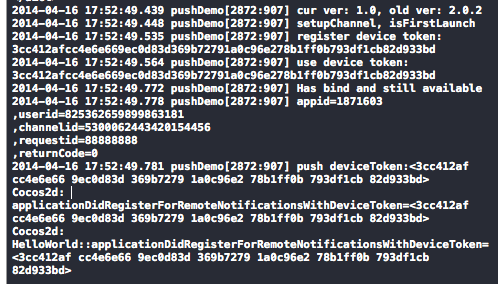
2. 收到push消息
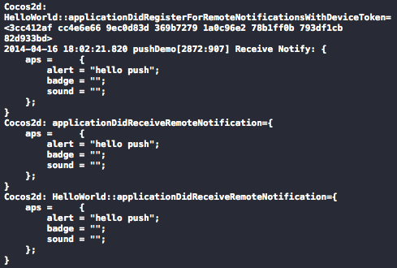
3.系统通知栏显示


### 后记

本demo 基于2.2版本实现，但是使用其他版本集成push功能与之类似，没有太大变化。 开发者可以灵活选择。 
push 消息的处理 和 使用第三方推送SDK集成也可以灵活选择。  
 完整资源下载地址[xxx]()


###FAQ
1. push 不能获取device Token "未找到aps environment 的权利字串"。  
可能原因:   
没有配置push 证书，App id 没有配置push。
2. push 不能再 模拟器 和 已经越狱的机子上工作
3. 收不到push 的可能原因:  
根据devlop or production 模式选取 对应的APNS push证书配置和profile.  
push 受网络因素影响，请检查网络连接是否畅通。  
push存在一定的延时

### 相关资料

1. [iOS RemoteNotifications Programming Guide](https://developer.apple.com/library/ios/documentation/NetworkingInternet/Conceptual/RemoteNotificationsPG/Introduction.html)
2. [百度云推送](http://developer.baidu.com/wiki/index.php?title=docs/cplat/push/guideios)
3. [极光push](http://docs.jpush.cn/pages/viewpage.action?pageId=2621727)
4. [个推](http://www.igetui.com/?page_id=90)
5. [ios push证书设置](http://docs.jpush.cn/pages/viewpage.action?pageId=1343727)

